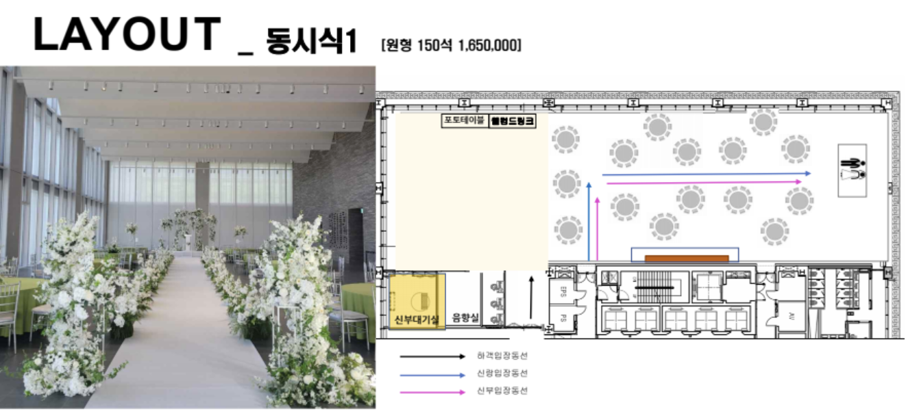

# 장소

네이버 1784 스카이홀

# 오셔야하는 시간

?

# 주차

주말에는 사내 주차장 개방되어 있습니다. 자차이용하신다면 참고 부탁드립니다.

# 레이아웃



네이버 사내외 발표를 위한 장소라서 예식 전문 홀에 비해 다소 아쉬운점이 많습니다.
일반 예식장은 직사각형에 뒤에 입장을 위한 큰 나무 문이 있지만
해당 장소는 그런것이 없습니다.
그림의 입장 동선의 시작부분에 문그림이 있는데 해당문은 없다고 생각하시면 됩니다. 신랑 신부는 문 뒤에 있다가 입장하는것이 아닌, 청중들에게 오픈되어 있다가 사회자 안내에 맞춰 입장하는것이라 보시면 되겠습니다.


# 대본

## 1. 안내멘트
안내 말씀드리겠습니다. 잠시 후 신랑 군과 신부 양의 축복된 결혼식을
거행할 예정입니다. 하객 여러분께서는 식장 안에 마련된 좌석에 착석을 부탁드립니다. 아울러 원할한 예식 진행을 위해 핸드폰은 진동으로 바꿔주시길 바랍니다.

## 2. 개식사
> 신랑 신부 이름 수정하였습니다.
```diff
-네 여러분 결혼식 진행을 위한 모든 준비를 마쳤습니다. 그럼 지금부터 신랑 군과 신부 양의 성스러운 결혼식을 시작하겠습니다.
+네 여러분 결혼식 진행을 위한 모든 준비를 마쳤습니다. 그럼 지금부터 신랑 최규범 군과 신부 채혜연 양의 성스러운 결혼식을 시작하겠습니다.
```
먼저 사회자 소개 하겠습니다. 저는 신랑신부와의 특별한 인연으로 오늘의 행복한 결혼식의 사회를 맡은
KBS 성우 윤세하입니다. 반갑습니다.(단상 옆으로 가서 인사)
오늘은 신랑 신부 두 사람 의 의미있는 날을 맞아 신랑신부의 마음이 내빈 여러분들에게도 전해졌으면 하는 바람을 담아 주례 없는 예식으로 거행하고자 합니다.
여러분께서는 모든 식순이 진행이 될 때 많은 박수와 환호로 예식 진행을 도와주시면 정말 감사하겠습니다. 그리고 오늘 가까이에서 멀리에서 신랑신부를 축복하러 이 곳을 찾아주신 우리 하객여러분께 신랑신부님이 꼭 다시한번 감사인사를 드리고 싶다고 말씀하셨습니다. 자 그럼 오늘의 결혼식 여러분의 큰박수와 함께 시작하겠습니다!!

## 3. 화촉점화
그럼 여러 번 오늘의 첫 번째 순서를 소개하도록 할텐데요. 여러분께서는 모두 뒤쪽을 바라봐 주시기 바랍니다. 너무나 아름다우신 양가어머님께서 화촉점화를 위해
한복을 곱게 차려입고 입장을 준비하고 계십니다. 양가 어머님께서 입장하실 때 다같이 뜨 거운 박수 부탁 드립니다. 양가 어머님 입장해주세요!// 여러분 큰 박수 부탁드리겠습니다.//

어머님들께서 손을 꼭 잡고, 아름답게 걸어오고 계십니다.// (계단)양가 어머님들께서는 단상 에 마련된 초에 불을 밝혀주시겠습니다. 먼저 신랑 어머님께서 초에 불을 밝혀주시겠습니다. 초에 불이 밝혀지면 여러분들의 따뜻한 박수 부탁드립니다.
이어서 신부 어머님께서 초에 불을 밝혀주시겠습니다. 역시 초에 불이 밝혀지면 따뜻한 박 수 부탁드립니다.
양가 어머님께서 단상 앞으로 이동해 주시구요. 서로를 마주봐주시고 인사를 하겠습니다.
양가 어머님 맞절!// 그리고 오늘 이렇게 특별히 시간내서 참석해주신 하객분들께 양가 어머님께서 인사를 드리겠습니다. 하객분들께 인사!// 어머님들께서는 마련된 자리에 착석해 주시기 바랍니다. 양가 어머님들께서 신랑 신부 두사람이 앞으로 행복하게 잘 살길 바라는 마음을 담아서 화촉점화 순서 잘 마무리 해 주셨습니다.

## 4.신랑입장
네 그럼 다음으로 오늘의 주인공 중 한사람인 우리 멋진 신랑의 입장이 있겠습니다.
뒤쪽 한번 보시면요, 오늘의 신랑이 입장을 준비하고 있습니다. 많이 떨릴 겁니다. 하지만 하객 여러분께서 아낌없는 박수와 함성을 보내주신다면 그 누구보다 멋지게 입장을 잘 할 수 있을 것 같습니다. 그렇다면 입장을 진행하겠습니다. 신랑 입장!

## 5.신부입장

> `커다란 문뒤에서` 수정 혹은 삭제 필요

```diff
-여러분께서는 다시 한번 뒤쪽을 바라봐 주시겠습니까?. 커다란 문뒤에서 오늘의 신부가 수줍은 마음을 안고 등장을 기다리고 있는데요. 문이 열리면서 너무나 눈부신 신부의
+여러분께서는 다시 한번 뒤쪽을 바라봐 주시겠습니까?. 오늘의 신부가 수줍은 마음을 안고 등장을 기다리고 있는데요. 문이 열리면서 너무나 눈부신 신부의
```
모습이 보일때 여러분께서는 다시한번 뜨거운 박수로 축복해 주시길 바랍니다.
신부님 입장하시죠.// 이제 신부는 천천히 계단위로 올라와 버진로드로 향하도록 하겠습니다 너무나 오랫동안 기다려왔고 또 설레었던 이 순간인데요. 신부의 수줍은 발걸음 발걸음마다

여러분께서는 다시 한번 찬란한 축복의 박수로 가득 채워주시길 바랍니다.
신부님 입장하시죠//
(박수끊길시) 너무나 아름다운 이순간 여러분의 박수가 끊이지 않았으면 좋겠습니다. 신랑님께서는 아버님께 인사해주시구요. 네 아버님 우리 신랑 꽉 한번 안아주시길 바랍니다. 이제 우리 신랑은 아버님께 신부의 손을 건네받아 약속의 단상으로 향하도록 하겠습니다. 이로써 오늘 너무 멋진 우리 신랑과 세상에서 가장 아름다운 오늘의 신부가 입장을 모두 마쳤습니다.

## 6. 신랑 신부 맞절
네 이제 하객 분들과 가족들 앞에서 성인의 예를 드리는 맞절의 순서가 있겠습니다.
우리가 처음 만났던 그 순간 그리고 함께했던 순간 그리고 영원을 약속했던 그 순간을 기억 하고 추억하며 인사하겠습니다. 신랑 신부 맞절.

## 7. 혼인서약 (신랑신부진행)
이제 신랑신부님께서는 하객석을 바라봐 주시기 바랍니다.
다음은 두 사람이 사랑의 서약을 통해 서로에게 사랑과 신뢰를 약속하는 시간을 갖도록 하겠습니다. 여기 계신 양가 부모님들과 하객 여러분들께서는 오늘의 혼인서약의 증인이 되어 주시기 바랍니다. 준비되셨으면 신랑,신부는 혼인서약서를 낭독해주세요.

## 9. 성혼선언 (신랑 아버지)
다음 순서는 결혼식에 가장 중요한 순서중 하나입니다. 바로 성혼선언문 낭독 순서인데요 성혼선언문은 양가를 대표해서 신랑님의 아버님께서 성혼선언을 해 주시겠습니다.
큰박수로 아버님 단상으로 모셔보겠습니다. //

이제 두 사람은 공식적인 부부가 되었습니다. 신랑신부의 첫걸음, 새출발을 축복하겠습니다. 여러분다시한번큰박수 보내주시죠

## 11. 덕담 (신고화 전 교장선생님)
다음은 두 사람의 새출발을 응원해주기 위한 덕담을 들어보는 시간을 갖도록 하겠습니다.
오늘 덕담은 우리 신부님의 전 직장 상사님이십니다. 신고화 전 교장선생님을 여러분들의 큰 박수와 함께 단상으로 모셔보겠습니다. // 두 사람의 앞날에 귀감이 될 아주 좋은 말씀 해 주셨습니다. 감사합니다.

## 12. 축가 (신랑 친구 임준영)
다음은 신랑 신부의 결혼을 축복하는 축가 순서입니다. 두 분의 결혼식을 위해 아주 멋진 노래가 준비가 되어 있습니다. 이 멋진 노래를 불러주실 오늘의 축가자는 신랑님의 친구 임 준영 님입니다. 많이 긴장되고 떨릴텐데요 오늘의 축가자분께 응원의 박수 보내주시기 바랍 니다!! !

## 13. 신랑 신부 양가부모님과 내빈께 인사
이제 이렇게 부부의 연을 맺기까지 열심히 길러주시고 그리고 지켜봐주신 양가 부모님들과
하객 여러분들께 인사를 올리도록 하겠습니다. 자 먼저 신부 부모님께 인사를 올리겠습니다.
작고 귀엽기만 했던 예쁜 딸이 어느덧 이렇게 숙녀가 되어 사랑하는 사람을 만나 가정을 꾸 린다고 합니다. 앞으로 많은 것이 걱정이 되시겠지만 행복하게 잘 사는 것으로 효도하며 살 겠습니다. 신랑 신부 인사 // 어머님 아버님 두 사람 따듯하게 한번 안아주십시요
누군가에겐 떠나야 한다는 누군가에겐 떠나 보내야 한다는 아쉬움의 순간일수도
있지만 이 아쉬움보다는 듬직한 아들이 생기는 응원과 축복이 더욱 가득한 시간이 될 것 같
습니다. 이제 신랑님과 신부님께서는 신랑님의 부모님 앞으로 천천히 이동하겠습니다.
오늘 이순간 신부 또는 신랑이 흘리는 눈물은 참으로 보석 같은 눈물입니다. 그 어여쁜 보 석을 보면서 여러분 따뜻한 박수로 함께 격려해 주셨으면 좋겠습니다.
우리 멋지고 자랑스러운 아들이 참으로 아름다운 한 사람을 지금 두 분 앞에 데리고 왔습니 다. 이 사람은 혼자 온 것이 아닌 가족이 왔고 그리고 한 세상이 왔습니다. 우리 자랑스럽게

키워주신 아들처럼 이제 앞으로 우리 새로운 가족에게 많은 사랑을 베풀어주십시오. 부족하 면 배우고 모르면 물어보면서 열심히 잘 살아보겠습니다. 신랑 신부 부모님께 인사
어머님 아버님 두 사람 따듯하게 한번 안아주십시오
이어서 오늘 두 사람을 이렇게 진심으로 축복해주신 하객 여러분들께 인사를 올리겠습니다. 신랑 신부는 가운데로 이동하겠습니다.
우리 누군가에게 감사하다는 표현을 할 때 보통 ‘덕분에; 라는 표현을 많이 합
니다. 우리 신랑 신부님께서 멋지고 아름답게 결혼을 할 수 있던 이유는 양가 부모님 덕분
이였구요 오늘 두사람이 행복하고 빛나는 하루를 준비할수 있었던건 오늘 참석해주신 많은 분들의 따뜻한 마음덕분일겁니다. 두 사람 그 마음을 평생 잊지않고 행복한 모습으로 갚아 나가며 열심히 살아보겠습니다. 신랑신부 하객분들께 인사.

## 14. 행진
이제 마지막으로 신랑 신부는 힘찬 행진을 통해 새로운 첫걸음을 내딛도록 하겠습니다.
신랑과 신부는 설레는 연애를 마무리하고 이제 두사람은 결혼이라는 이름으로 새로운 출발
을 준비합니다. 오늘 사랑이 가득한 이 곳에서 두 사람이 약속에 마음을 담아서 함께 행진 하면 그 약속을 평생 지켜나가면서 살 수 있도록 여러분께서 뜨거운 박수와 사랑 아낌없이 보내주셨으면 좋겠습니다. 두사람. 부부로서의 첫 걸음을 함께 응원해 주시기 바랍니다. 이 제 두 사람이 여러분 곁으로 행진합니다 신랑신부 행진

## 15. 폐식
흩날리는 꽃잎처럼 신랑 신부를 비추는 수많은 불빛처럼 신랑신부의 매일에 항상 행복하고 찬란한 일들만 있기를 바라면서 오늘 결혼식을 모두 마치겠습니다.
이어서 사진촬영이 있을 예정이오니. 가족 친지 하객 여러분께서는 끝까지 함께 해 주시면

감사하겠습니다. 지금까지 저는 사회자 윤세하였습니다. 감사합니다
